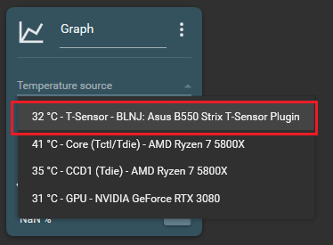

# ASUS ROG STRIX B550 FanControl T-Sensor Plugin

This is just a little Plugin I wrote to add the Temperatures reading from the ASUS ROG STRIX B550 Motherboards T-Sensor to FanControl. 
Honestly I only wrote that for me, since I use the T-Sensor to Monitor my Watercooling Water temperature, but it might be useful for someone else.

## Installing
Just copy the Files from the Release ZIP into the Plugins Folder from FanControl and just completely restart the Application. 
Maybe make sure that the Plugin is activated in the Sensor Settings

## How it works
This just makes use of OpenHardwareMonitor, where I look for a specific Sensor from the Motherboard.
Nothing fancy really and just threw this together in a few minutes.

## Building
In order to Build the Plugin you have to copy "FanControl.Plugins.dll" from your FanControl Installation into the "Dependencies" Folder. 
After that just recover the NuGet Packages (which VisualStudio should do itself) and you´re good to go.

## Debugging
For this I created a seperate Project with the ending ".Test", which replicates the behaviour of FanControl. 
Make sure you start VisualStudio as Admin, since FanControl and all Plugins itself also run with elevated privileges. And otherwise OpenHardwareMonitor cant see the underlying Sensors.

## Links
FanControl: https://github.com/Rem0o/FanControl.Releases  
OpenHardwareMonitor: https://github.com/openhardwaremonitor/openhardwaremonitor
